# Rapport de Workshop - Prog & Algo

## Table des matières

- [Rapport de Workshop - Prog \& Algo](#rapport-de-workshop---prog--algo)
  - [Table des matières](#table-des-matières)
  - [1. Ne garder que le vert](#1-ne-garder-que-le-vert)
    - [1.1. Custom effect : Ne garder que le rouge](#11-custom-effect--ne-garder-que-le-rouge)
  - [2. Échanger les canaux](#2-échanger-les-canaux)
  - [3. Noir \& Blanc](#3-noir--blanc)
  - [4. Négatif](#4-négatif)
  - [5. Dégradé](#5-dégradé)
  - [6. Miroir](#6-miroir)
  - [7. Image bruitée](#7-image-bruitée)
  - [8. Rotation de 90°](#8-rotation-de-90)
  - [9. RGB Split](#9-rgb-split)
  - [10. Luminosité](#10-luminosité)
  - [11. Disque](#11-disque)
    - [11.1. Cercle](#111-cercle)
    - [11.2. Animation](#112-animation)
    - [11.3. Rosace](#113-rosace)
  - [12. Mosaïque](#12-mosaïque)
    - [12.1. Mosaïque miroir](#121-mosaïque-miroir)
  - [13. Glitch](#13-glitch)
  - [14. Tri de pixels](#14-tri-de-pixels)
  - [15. Fractale de Mandelbrot](#15-fractale-de-mandelbrot)
  - [16. Dégradés dans l'espace de couleur Lab](#16-dégradés-dans-lespace-de-couleur-lab)
  - [17. Tramage](#17-tramage)
  - [18. Normalisation de l'histogramme](#18-normalisation-de-lhistogramme)
  - [19. Vortex](#19-vortex)
  - [20. Convolutions](#20-convolutions)
- [Merci !](#merci-)

---

## 1. Ne garder que le vert

Pour ce premier effet, je ne garde que la composante verte en mettant les composantes rouge et bleue à zéro.

Je parcours tous les pixels et mets chaque pixel à 0 pour le rouge et le bleu, tandis que le vert reste inchangé.


### 1.1. Custom effect : Ne garder que le rouge

En m'inspirant grandement de l'exercice précédent, j'ai décidé d'innover un peu et de laisser parler ma créativité. Je propose ainsi l'effet "keep red only".


---

## 2. Échanger les canaux

Pour échanger les canaux, je parcours tous les pixels et ensuite j'utilise la fonction `swap` me permettant d'inverser les couleurs bleue avec les couleurs rouge.


---

## 3. Noir & Blanc

Pour faire cet effet, j'ai donc repris les cours de Monsieur Rolland pour appliquer la formule à savoir : 0,30 de rouge + 0,59 de vert + 0,11 de bleu.

Une fois avoir calculé la moyenne, je la remets sur tous les pixels.


---

## 4. Négatif

Je parcours tous les pixels de l'image puis j'inverse les couleurs.

Je fais cela pour toutes les composantes de la couleur :

```cpp
color.r = 1 - color.r;
```

Ainsi je suis à son maximum et j'enlève sa couleur, ce qui inverse la couleur.


---

## 5. Dégradé

Pour le dégradé, je parcours l'image en X et en Y, par rapport à avant où je parcourais l'image avec une seule boucle.

Ma couleur est variable via `pixel`, qui est divisé par la largeur de l'image. Donc au début on est très noir car X est petit, et donc f aussi. Puis tour après tour, itération par itération, le pixel devient blanc, ce qui forme le dégradé.

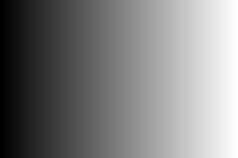

---

## 6. Miroir

Pour l'effet de miroir, j'ai réutilisé la fonction `swap`. En bouclant sur tous les pixels, je prends le premier pixel et le mets à la fin !

**Attention !** Il faut bien sûr ne parcourir que la moitié de l'image, autrement on va échanger l'échange, c'est-à-dire revenir sur la version initiale.


---

## 7. Image bruitée

J'ai appliqué un random qui choisit une position aléatoire pour le pixel qu'on va changer.

Puis après, je récupère un random qui choisit une valeur aléatoire pour les couleurs (les composantes vert, rouge et bleu).

Pour l'image bruitée, j'ai eu au début une image avec uniquement des pixels rouges qui swappaient, j'ai donc refait. Ainsi, dans le résultat, je change bien toutes les couleurs aléatoirement.


---

## 8. Rotation de 90°

J'ai eu un peu de mal avec la rotation à 90°. J'ai fait étape par étape, mais le vrai problème mathématique était de me le représenter sur un tableau, puis de transférer ce que j'avais réalisé au tableau.

Après plusieurs essais, j'ai réussi à faire en sorte qu'il y ait bien une rotation de 90°.

J'avais juste un problème : en créant ma nouvelle image temporaire, je ne redimensionnais pas à l'ancienne image retournée donc j'avais des bugs ! (de plus, à la fin je ne mettais pas la `new image` dans `image`)


---

## 9. RGB Split

Pour le RGB split, on peut changer la valeur de décalage. Pour le décalage, quand on arrive proche des bords, j'ai mis des conditions pour avoir l'image originale, sinon le résultat aurait été noir et donc visuellement moins beau.

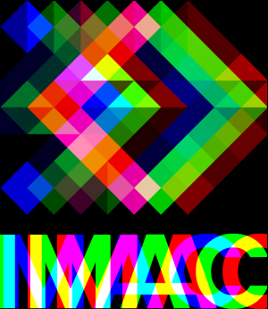

---

## 10. Luminosité

Pour la luminosité, j'utilise la fonction `pow` qui fait un carré. Ainsi je passe bien entre 0 et 1 sur f, et donc je peux régler pour éclaircir si la puissance est en dessous de 1, et assombrir si la puissance est supérieure à 1.

Ce qui m'a beaucoup aidé était le site type GeoGebra.

**Résultats :**

Éclaircir : 
Assombrir : 

---

## 11. Disque

Sur le disque, j'ai utilisé la formule pour calculer la distance :

$$\sqrt{(x_1-x_2)^2 + (y_1-y_2)^2}$$

Grâce à cela, je peux savoir si le point est dedans ou dehors de mon cercle et donc mettre en couleur noire ou blanche.

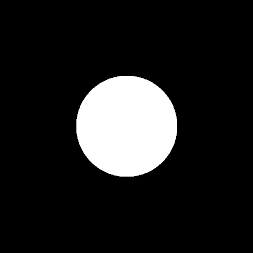

### 11.1. Cercle

Pour le cercle, je reprends le code du disque et j’ajoute une condition dans le if afin de savoir si un pixel se situe bien dans l’anneau du cercle ou non.
Le principe consiste à calculer la distance entre chaque pixel et le centre de l’image.
Si cette distance est inférieure au rayon du cercle et supérieure au rayon moins l’épaisseur, alors le pixel appartient au cercle et est coloré en blanc.
Sinon, le pixel est coloré en noir.

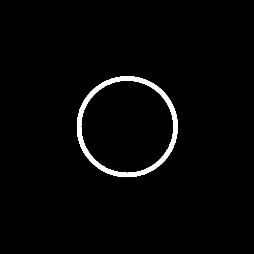

### 11.2. Animation

Pour l'animation, je suis reparti du code du disque que j'ai ensuite adapté pour qu'on commence à X qui vaut la valeur du tour. Ainsi, le GIF en fonction du tour, la position du cercle va aussi changer sur l'axe des abscisses.

Pour les itérations dans mon main, j'utilise :

```cpp
std::string path = std::format("output/gif_disque/Disque_gif_{}.png", count);
```

qui va créer des images avec des titres différents à chaque tour.

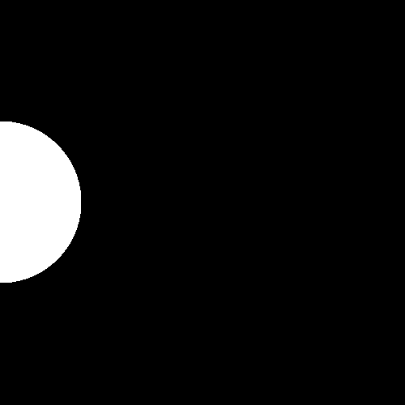

### 11.3. Rosace

Pour la rosace, j'ai eu un peu de mal. J'ai repris le code du cercle et ajouté une boucle. Néanmoins, l'élément qui m'a bloqué était la position des autres cercles. Après discussion, j'ai donc utilisé les coordonnées polaires pour pouvoir placer le centre de mon cercle au bon endroit.
Je peux dans le code choisir le nombre de cercles que je souhaite.

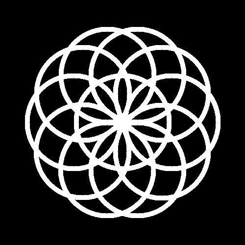

---

## 12. Mosaïque

Pour la mosaïque, je crée une image qui est 5 fois supérieure à la première (ici la variable `nb_repetition`). Puis je parcours la première image et tous les pixels, je les copie sur la nouvelle image. Je le fais en X et en Y, 5 fois en appliquant à chaque nouveau tour un décalage sur ma nouvelle image.


### 12.1. Mosaïque miroir

u début, je suis parti sur un simple système de swap, mais cela produisait seulement des carrés sans effet miroir...

Après plusieurs essais et schema et en modifiant différents paramètres, j’ai compris qu’il existait quatre cas possibles selon la position dans la mosaïque :

- normale
- inversée horizontalement
- inversée verticalement,
- inversée horizontalement et verticalement.

J’ai donc ajouté des conditions qui testent si l’indice de répétition est pair ou impair afin d’appliquer ou non une inversion sur les axes x et y.


---

## 13. Glitch

Pour l’effet glitch, j’utilise des valeurs aléatoires.
À chaque itération, deux zones rectangulaires sont sélectionnées puis swapé entre elles.
Les positions, la largeur et la hauteur des rectangles sont générées aléatoirement.


---

## 14. Tri de pixels

Au tout début, pour le tri de pixels, je suis reparti de l’effet glitch, mais c’était une mauvaise approche et cela ne fonctionnait pas correctement.

Avec l’aide de Roméo, j’ai compris qu’il fallait plutôt récupérer une portion de pixels dans un tableau, puis les trier selon leur luminosité.

Je sélectionne une ligne aléatoire de l’image ainsi qu’un segment horizontal de taille aléatoire. Les pixels de ce segment sont stockés dans un vecteur, puis triés grâce à la fonction brightness.
Une fois le tri effectué, les pixels sont replacés au même endroit dans l’image.


---

## 15. Fractale de Mandelbrot

Pour la fractale, j’ai eu du mal au début à comprendre comment fonctionnent les nombres complexes et comment les utiliser.
J'utilise le nombre d’itérations pour déterminer la couleur des pixels.

Si la valeur absolue de z dépasse 2, alors le point ne fait pas partie de la fractale, le pixel est noir sinon il sera blanc. Il a fallu convertir de toutes les valeurs pour qu'elles rentrent dans l'inteval[ -2 ; 2 ].

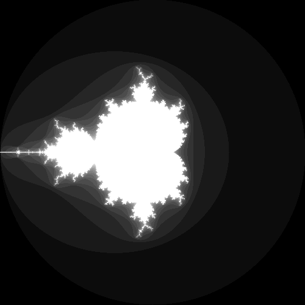

---

## 16. Dégradés dans l'espace de couleur Lab

La fonction `glm::mix` était un peu compliquée à comprendre car la documentation n'était pas très explicite. Mais une fois avoir compris qu'elle mélangeait ces deux composants avec un float qui va faire le dégradé, c'était tout de suite plus simple.

**Terrible erreur:** je ne comprenais pas pourquoi mon code ne fonctionnait pas et ne m'affichait qu'une seule couleur.

Le problème était que j'avais bien un `static_cast` pour convertir en float, mais toute ma division était d'int... donc int divisé par int ça fait int, même avec un `static_cast` j'avais 0.

**Code correct :**

```cpp
degrade = static_cast<float>(x) / static_cast<float>(image.width());
```

**Code erroné (avant) :**

```cpp
degrade = static_cast<float>(x / image.width());
```

Pour l'OKLab, je me suis grandement appuyé sur l'article proposé. J'ai repris les bonnes valeurs mises à disposition puis reconverti de linear RGB vers sRGB. Enfin, j'ai appliqué à tous les pixels la bonne valeur convertie.

J'ai mis du random pour qu'à la génération, le résultat change !

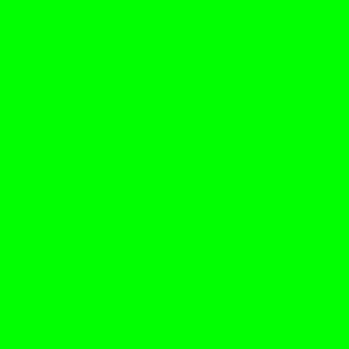

---

## 17. Tramage

Pour le tramage, j'ai repris essentiellement le code de l'article mis à disposition et je l'ai adapté pour qu'il fonctionne, en supprimant les variables qui ne servaient à rien et en appliquant la matrice.

Après avoir fait la moyenne du pixel, je l'applique à ma matrice puis je regarde si le résultat est plus proche de noir ou plus proche de blanc, auquel cas le pixel devient complètement blanc ou complètement noir.

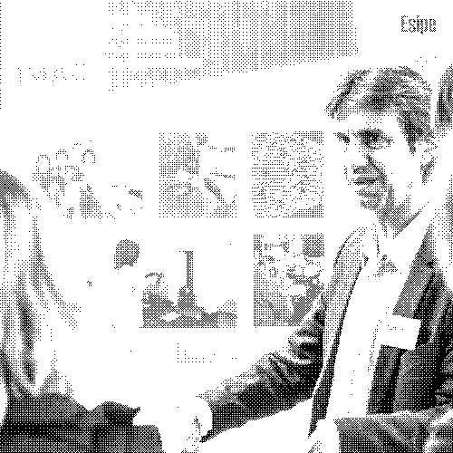

---

## 18. Normalisation de l'histogramme

<!-- ppur cette effet ,je denvait tout remet le peltuet pteite nomreb de pixel devnenitn 0 et le plus grna d1 donc apres avori fait un shceme et touve rle clacu l
``
   color = (color - min_brightness) / (max_brightness - min_brightness);


``
on a bigneun enoramsiation de l'iamge  -->

Pour cet effet, je devais recaler les valeurs de luminosité afin que le pixel le plus sombre devienne 0 et que le pixel le plus lumineux devienne 1.

Après avoir fait un schéma et trouvé la formule de calcul, j’ai utilisé la normalisation suivante :
`color = (color - min_brightness) / (max_brightness - min_brightness)`

Dans un premier parcours de l’image, je calcule la luminosité minimale et maximale.

Ensuite, lors d’un second parcours, j’applique la formule à chaque pixel afin d’étirer les valeurs sur toute la plage [0, 1].


## 19. Vortex

Le calcul le plus important ici est la distance entre le point et le centre.

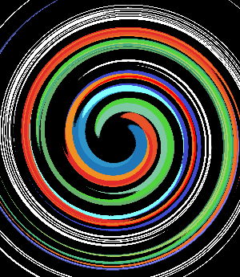

En changeant le paramètre en mettant `distance * radian`, on obtient ce joli effet qui est amusant. C'est un autre effet, donc pas vraiment un échec, mais voilà.

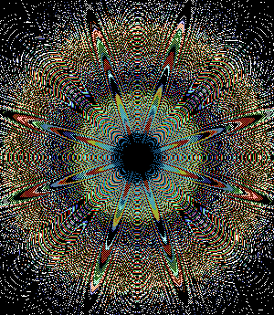

**Et le fail :**
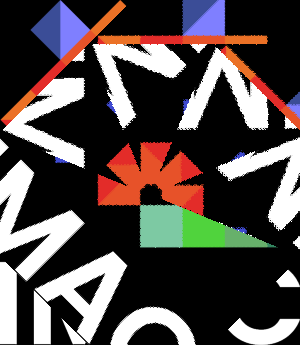

---

## 20. Convolutions

Pour la convolution, j'ai donc utilisé les matrices du site donné.
Après avoir mis la matrice en place (et compris comment elle fonctionnait), j'ai pu appliquer les différents filtres.
(bon, je duplique la fonction donc pas top... Je n'ai plus trop le temps mais c'est une amélioration assez simple pour créer toutes les images sans dupliquer le code. Il faut faire un peu comme le gif)


**Le fail :**


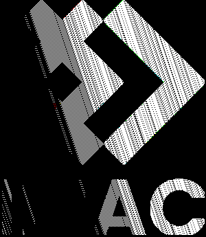

---

# Merci !
